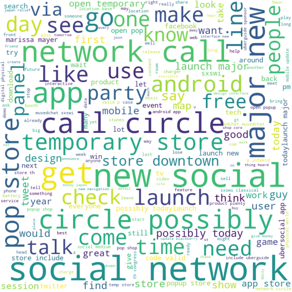

# Using Consumer Sentiment to Ad Target Consumers

## Overview 

We are a marketing consulting company named Emo-Vector LLC that specializes in marketing insights derived from emotion. We aim to expand the reach of emerging Asian consumer electronics companies such as Samsung, Xiaomi, Oppo, and Vivo by utilizing targeted online advertising. We hope to use the power of big data to create a model that can swiftly and efficiently target consumers who have non-positive emotions towards brand competitors such as Apple and Google. 

Our presentation, where we analyze our dataset can be found at: ["Consumer Sentiment Analysis"](Presentation.pdf)

## Business Problem

## Data Understanding 

## Modeling and Classification Results

## Next Steps

* Increase the size of our data set and incorporate real-time tweet data
* Build a tweet-scraping tool filtered by Apple or Google product
* Train the model on balanced data set
* Monitor ad clicks and impressions for targeted ads vs non-targeted

## Conclusion 

