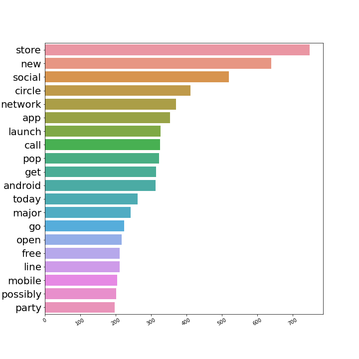
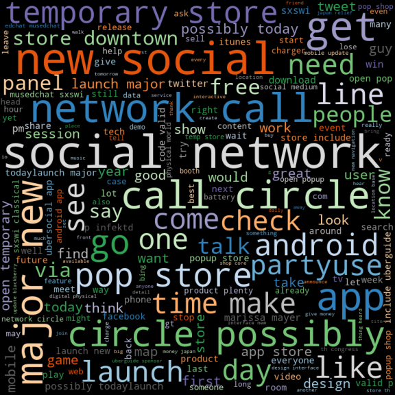

# Using Consumer Sentiment to Ad Target Consumers

## Overview 

We are a marketing consulting company named Emo-Vector LLC that specializes in marketing insights derived from emotion. We aim to expand the reach of emerging Asian consumer electronics companies such as Samsung, Xiaomi, Oppo, and Vivo by utilizing targeted online advertising. We hope to use the power of big data to create a model that can swiftly and efficiently target consumers who have non-positive emotions towards brand competitors such as Apple and Google. 

Our presentation, where we analyze our dataset can be found at: ["Consumer Sentiment Analysis"](Presentation.pdf)

## Business Problem

Advertisements are often not tailored to a consumers wants and needs. This leads to marketing spend waste and inefficiencies by missing high ROI audience for the product. A Proxima estimate estimates $37 billion of worldwide marketing budgets are being wasted on poor digital performance a year. We aim to help reduce marketing spend waste by targeting consumers who have non-positive emotions toward brand competitors. 

## Data Understanding 

We are sourcing the data for this project from Twitter which can be found at Phase4_tweet_dataset.csv in the [data](Data/) folder in the GitHub repository. We analyzed 9,092 tweets during the South by Southwest music festival. Our visualizations can also be found seperately in the [Images](Images/) folder located in this repository. We will analyze a list of variables from Twitter data set such as the individual tweet text, the product at which the tweet is directed, and a target variable of positive, negative, or neutral emotion tweets. Limitations of the data include class imbalance, where only 33% of our data points are considered positive tweets (67% non-positive). Also, a vast majority of the tweets within the data set are neutral emotion, therefore limiting the ability of the model to learn positive and negative emotions.  

## Modeling and Classification Results

Our best model had an overall accuracy score of 73% on unseen data while also identifying 85% of actual non-positive emotion tweets. Our model only missed 224 out of 1,510 non-positive emotion tweets. We are focused on recall score because we are more willing to accept false positives and want to find and target all non-positive emotion tweets. 

Our model only identified 49% of positive emotion tweets. We believe that the imbalance between the number of non-positive emotion tweeets vs. positive emotion tweets played a role in missing a large portion of positive tweets. Positive emotion tweets only made up 33% of our dataset, vs. 67% non-positive.

### Non-Positive Emotion Tweet Top Words

The visualization above shows the most common word in non-positive emotion tweets.

### Non-Positive Emotion Tweet WordCloud

The visualization above shows the most common word in non-positive emotion tweets.

## Next Steps

* Increase the size of our data set and incorporate real-time tweet data
* Build a tweet-scraping tool filtered by Apple or Google product
* Train the model on balanced data set
* Monitor ad clicks and impressions for targeted ads vs non-targeted

## Conclusion 

Our model ExtraTreesClassifier is a tool that helps to:

* Predict tweet sentiment based on the tweet text
* Target consumers who express non-positive emotions towards competitor brands
* Tailor online advertisements to those consumers efficiently

Our model was highly effective at identifying non-positive emotion tweets and found 85% of actual non-positive tweets when tested against unseen data. The model also had an overall acuracy score of 73%, meaning the model correctly labeled the emotion in 73% of all tweets in the unseen data set. The model identified 49% of all actual positive emotion tweets. 

